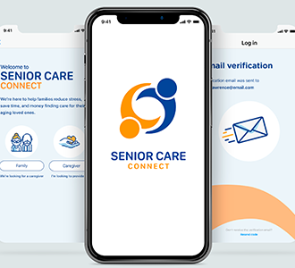

# SeniorCare 

------------------------------------------------------
### About:

Seniorcare is a full stack mobile application for the client Senior Care Connect, which was built with five other developers. The App accepts two major clients; the care giver and family member looking for the service. The professionally certified care givers can register in the App and apply for the job. They can apply for multiple jobs and can chat with the person looking for such a service. It is powerfull App that can host thousands of job application and many other useful services dedicated to seniors who are in need of assistance. 

## Technoloogies used: 

* React Native
* Redux
* Apollo
* GraphQL
* Express
* PostGreSQL
* Git

## Software used in this Project:

* Visual Studio Code
* GitHub
* Google Chrome Developer Tools

## Developed by:
Alam Talash & five classmates

@: RED Academy Toronto

#### Date: June 2019
